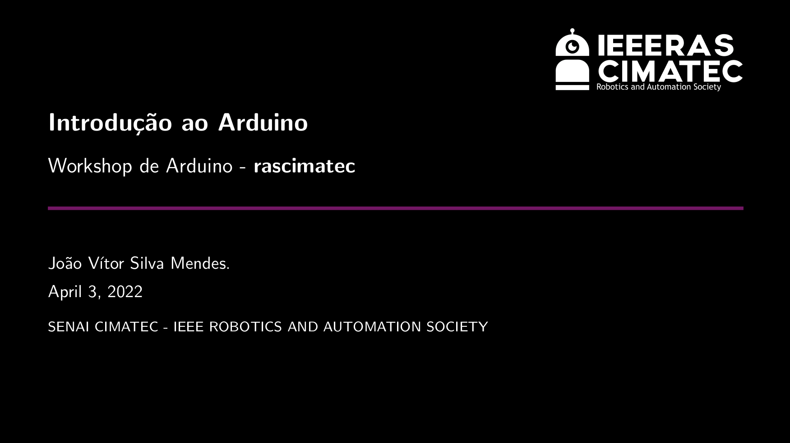

# RAS Cimatec Beamer

<p align="center">
  
</p>


## Use our template

Follow the command line above:

```bash
# Clone this repository
$ git clone https://github.com/rascimatec/ras-beamer

# Go into the repository
$ cd ras-beamer

# Open on VS Code
$ code .

```


### Author

**João Vítor S Mendes** 

Chair of RAS CIMATEC in 2022
- Email: vitor.mendes@ieee.org
- GitHub: @vitorsmends
- Linkedin: [Click Here](https://linkedin.com/in/vitorsmends/)

## Main inspiration
Unofficial CU Boulder Aerospace Beamer Template

Creative Commons CC BY 4.0

Author: Pol Mesalles Ripoll

License: Creative Commons CC BY 4.0

[Click Here](https://pt.overleaf.com/latex/templates/unofficial-cu-boulder-aerospace-beamer-template/wtjhtwdnshsn) to see the original template.

